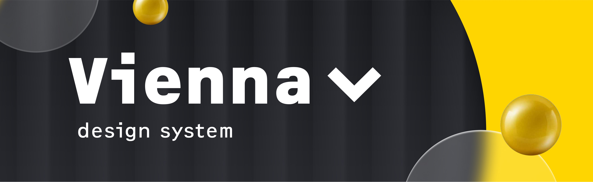

# ViennaUI

###### Raiffeisenbank Design System

[](https://github.com/Raiffeisen-DGTL/ViennaUI/blob/master/LICENSE.md) [](https://lerna.js.org/)

<p align='center'>
    
</p>

## Changelog

Список изменений 2.0.0 версии относительно 1.x.x можно [посмотреть по ссылке](CHANGELOG.md).

## Установка

Для установки библиотеки React компонентов:

```bash
$ npm i vienna-ui
$ yarn add vienna-ui
```

Дизайн Система Vienna.UI содержит еще 9 пакетов: `vienna.config-eslint`, `vienna.config-typescript`, `vienna.icons`, `vienna.react-use`, `vienna.svg2tsx`, `vienna.tokens`, `vienna.ui-primitives`, `vienna.ui-theme`, `vienna.utils`

Любой из приведенных выше пакетов также можно установить, вызвав:

```bash
$ npm i <package-name>
$ yarn add <package-name>
```

## Использование

В пакете `vienna-ui` находятся компоненты дизайн-системы, которые содержат собранные `js` файлы (скомпилированные через [Babel](https://babeljs.io)).

```
import React form 'react';
import ReactDOM from 'react-dom';
import { Body, Button } from 'vienna-ui';
import { PlusRing } from 'vienna.icons';

const App = (
    <Button design='accent'>
        Кнопка <PlusRing />
    </Button>
);

ReactDOM.render(app, document.getElementById('root'));
```

## Компоненты

-   [Alarm](workspaces/ui/src/Alarm/README.md)
-   [Alert](workspaces/ui/src/Alert/README.md)
-   [Avatar](workspaces/ui/src/Avatar/README.md)
-   [Badge](workspaces/ui/src/Badge/README.md)
-   [Breadcrumbs](workspaces/ui/src/Breadcrumbs/README.md)
-   [Button](workspaces/ui/src/Button/README.md)
-   [Calendar](workspaces/ui/src/Calendar/README.md)
-   [Card](workspaces/ui/src/Card/README.md)
-   [Checkbox](workspaces/ui/src/Checkbox/README.md)
-   [CSSGrid](workspaces/ui/src/CssGrid)
-   [Chips](workspaces/ui/src/Chips/README.md)
-   [ComboButton](workspaces/ui/src/ComboButton/README.md)
-   [Counter](workspaces/ui/src/Counter/README.md)
-   [DateTimePicker](workspaces/ui/src/DateTimePicker/README.md)
-   [Datepicker](workspaces/ui/src/Datepicker/README.md)
-   [DatepickerRange](workspaces/ui/src/DatepickerRange/README.md)
-   [Drawer](workspaces/ui/src/Drawer/README.md)
-   [DropList](workspaces/ui/src/DropList/README.md)
-   [EmptyState](workspaces/ui/src/EmptyState/README.md)
-   [FileLoader](workspaces/ui/src/FileLoader/README.md)
-   [FileLoaderButton](workspaces/ui/src/FileLoaderButton/README.md)
-   [Filter](workspaces/ui/src/Filter/README.md)
-   [Flex](workspaces/ui/src/Flex/README.md)
-   [FormField](workspaces/ui/src/FormField/README.md)
-   [Grid](workspaces/ui/src/Grid/README.md)
-   [Groups](workspaces/ui/src/Groups/README.md)
-   [Header](workspaces/ui/src/Header/README.md)
-   [Hint](workspaces/ui/src/Hint/README.md)
-   [Input](workspaces/ui/src/Input/README.md)
-   [InputAccount](workspaces/ui/src/InputMask/Concrete/InputAccount/README.md)
-   [InputCard](workspaces/ui/src/InputMask/Concrete/InputCard/README.md)
-   [InputDate](workspaces/ui/src/InputMask/Concrete/InputDate/README.md)
-   [InputDateRange](workspaces/ui/src/InputMask/Concrete/InputDateRange/README.md)
-   [InputDigital](workspaces/ui/src/InputMask/Concrete/InputDigital/README.md)
-   [InputMask](workspaces/ui/src/InputMask/README.md)
-   [InputNumber](workspaces/ui/src/InputMask/Concrete/InputNumber/README.md)
-   [InputPassword](workspaces/ui/src/InputPassword/README.md)
-   [InputPhone](workspaces/ui/src/InputMask/Concrete/InputPhone/README.md)
-   [InputSlider](workspaces/ui/src/InputSlider/README.md)
-   [Link](workspaces/ui/src/Link/README.md)
-   [Logotype](workspaces/ui/src/Logotype/README.md)
-   [Modal](workspaces/ui/src/Modal/README.md)
-   [Monthpicker](workspaces/ui/src/Monthpicker/README.md)
-   [Multiselect](workspaces/ui/src/Multiselect/README.md)
-   [Notifications](workspaces/ui/src/Notifications/README.md)
-   [Pagination](workspaces/ui/src/Pagination/README.md)
-   [PaymentLogo](workspaces/ui/src/PaymentLogo/README.md)
-   [Popover](workspaces/ui/src/Popover/README.md)
-   [Progressbar](workspaces/ui/src/Progressbar/README.md)
-   [Radio](workspaces/ui/src/Radio/README.md)
-   [RoundIcon](workspaces/ui/src/RoundIcon/README.md)
-   [Search & Suggest](workspaces/ui/src/Search/README.md)
-   [Select](workspaces/ui/src/Select/README.md)
-   [Sidebar](workspaces/ui/src/Sidebar/README.md)
-   [Spinner](workspaces/ui/src/Spinner/README.md)
-   [Stepper](workspaces/ui/src/Stepper/README.md)
-   [Switcher](workspaces/ui/src/Switcher/README.md)
-   [Table](workspaces/ui/src/Table/README.md)
-   [Tabs](workspaces/ui/src/Tabs/README.md)
-   [Textarea](workspaces/ui/src/Textarea/README.md)
-   [Timer](workspaces/ui/src/Timer/README.md)
-   [Toolbar](workspaces/ui/src/Toolbar/README.md)
-   [Tooltip](workspaces/ui/src/Tooltip/README.md)
-   [Typography](workspaces/ui/src/Typography/README.md)
-   [UserProfile](workspaces/ui/src/UserProfile/README.md)
-   [Whitespace](workspaces/ui/src/Whitespace)

## Кастомизация компонентов

Компоненты можно кастомизировать с помощью `ThemeProvider` и токенов. Подробнее об этом [здесь](workspaces/ui-theme/README.md)

## Технологический стек и браузеры

Компоненты дизайн-системы разработаны с использованием `react@16`, `styled-components@4`. Мы поддерживаем стабильные версии следующих браузеры:

-   Chrome (2 latest)
-   Firefox (2 latest)
-   Safari (2 latest)
-   Yandex (2 latest)
-   Edge (2 latest)
-   IE (11+)

## Скрипты миграции

Для комфортного перехода на новые мажорные версии дизайн системы мы пишем скрипты миграции/Codemods. Полный список можно [посмотреть здесь](workspaces/codemods/README.md)
